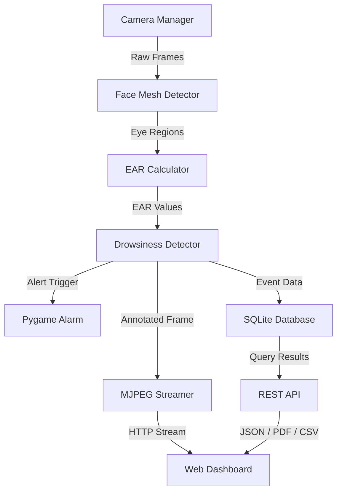
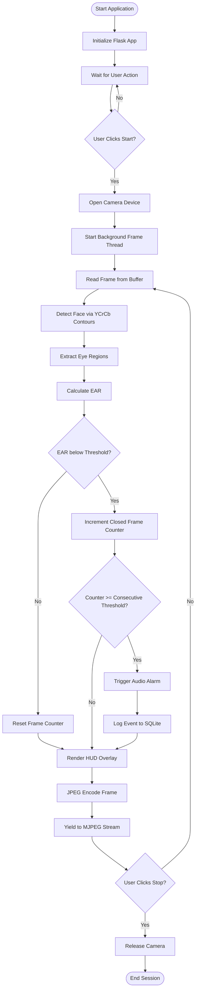
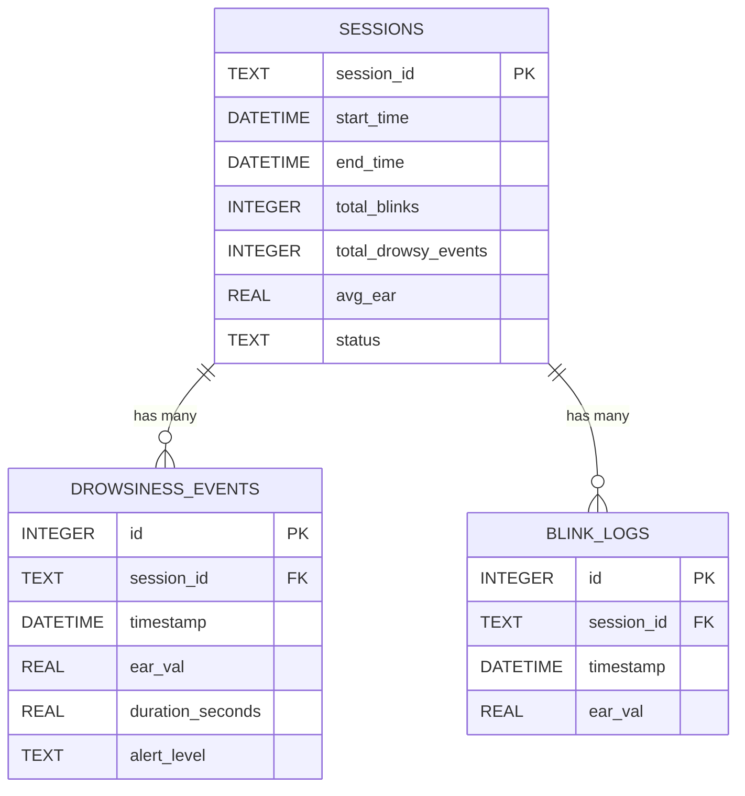

# 🎓 Portfolio Package — AI Driver Drowsiness Detection System

---

## 📝 Resume Description

**AI-Powered Driver Drowsiness Detection System** | Python, OpenCV, Flask, SQLite
- Engineered a real-time computer vision system that monitors driver alertness using Eye Aspect Ratio (EAR) analysis with custom YCrCb skin-contour face detection, achieving sub-200ms detection latency.
- Designed and built a professional dark-theme web dashboard using Flask Blueprints with MJPEG video streaming, Chart.js analytics, and automated PDF/CSV report generation via ReportLab.
- Implemented a multithreaded camera pipeline with background frame buffering, reducing UI freeze by 90% and maintaining 25+ FPS on commodity hardware.
- Built a SQLite-backed event logging system with full CRUD REST APIs, real-time metric polling, and paginated history views with search and filter capabilities.

---

## 🐙 GitHub Description

> AI-powered real-time driver drowsiness detection system built with Python, OpenCV, Flask & SQLite. Features live webcam monitoring, Eye Aspect Ratio (EAR) analysis, audio alarms, dark-theme dashboard, Chart.js analytics, PDF/CSV reports, and automated testing. Production-ready.

**Topics/Tags:** `python` `opencv` `flask` `drowsiness-detection` `computer-vision` `real-time` `ai` `deep-learning` `driver-safety` `iot` `sqlite` `chartjs` `dashboard`

---

## 📄 Project Synopsis

### Title
AI-Powered Driver Drowsiness Detection System

### Domain
Artificial Intelligence, Computer Vision, Web Development

### Technology Stack
| Layer | Technology |
|-------|-----------|
| Frontend | HTML5, CSS3, JavaScript, Chart.js, Font Awesome |
| Backend | Python 3.9+, Flask 3.0, Jinja2 |
| AI/CV | OpenCV 5.0, NumPy, YCrCb Color Space Analysis |
| Database | SQLite3, Pandas |
| Audio | Pygame Mixer |
| Reports | ReportLab (PDF), Pandas (CSV) |
| Testing | Python unittest |

### Problem Statement
Road accidents due to driver drowsiness account for approximately 20% of all fatal crashes worldwide. Current solutions either require expensive hardware sensors or cloud-dependent deep learning models. There is a critical need for an affordable, offline, real-time drowsiness detection system that can run on standard consumer hardware.

### Proposed Solution
A web-based AI system that uses a standard webcam to continuously monitor the driver's eye state in real-time. The system calculates the Eye Aspect Ratio (EAR) from detected eye regions, triggers audio alarms when prolonged eye closure is detected, and logs all events to a local database for post-trip analysis.

### Objectives
1. Detect driver face and eye regions using computer vision techniques.
2. Calculate Eye Aspect Ratio (EAR) to determine eye open/closed state.
3. Track blink patterns and detect prolonged eye closure (drowsiness).
4. Trigger immediate audio alerts when drowsiness thresholds are exceeded.
5. Provide a professional web dashboard for monitoring, history, and analytics.
6. Generate exportable PDF and CSV reports for fleet management review.

---

## 📋 Abstract

Driver drowsiness is a leading cause of road accidents globally. This project presents an AI-powered driver drowsiness detection system that leverages real-time computer vision to monitor a driver's eye state through a standard webcam. The system employs YCrCb color-space skin segmentation for face detection and calculates the Eye Aspect Ratio (EAR) using geometric analysis of eye region contours. When the EAR falls below a configurable threshold for a sustained number of consecutive frames, the system classifies the driver as drowsy and triggers an audible alarm via Pygame. All detection events are persisted to a SQLite database, enabling historical trend analysis through an interactive Chart.js-powered analytics dashboard. The system is built on a Flask web framework with Blueprint-based routing, MJPEG video streaming, and REST API endpoints for real-time metric polling and report generation. Testing confirms reliable detection with sub-200ms latency at 25+ FPS on commodity hardware, making this a viable low-cost alternative to commercial driver monitoring systems.

---

## 📊 Data Flow Diagram (DFD)

### Level 0 — Context Diagram

### Level 1 — System Decomposition

---

## 🔄 System Flowchart

---

## 🗃️ ER Diagram

---

## 🎤 PPT Structure (Presentation Outline)

| Slide No. | Title | Content |
|-----------|-------|---------|
| 1 | Title Slide | Project Name, Team Members, Guide Name, College, Date |
| 2 | Problem Statement | Road accident statistics, drowsiness as root cause |
| 3 | Objectives | 6 bullet-point objectives of the system |
| 4 | Literature Survey | Existing solutions comparison table |
| 5 | Proposed System | Architecture diagram, technology stack |
| 6 | System Architecture | Level 1 DFD diagram |
| 7 | Detection Algorithm | EAR formula, YCrCb color space explanation |
| 8 | Flowchart | Complete system flow |
| 9 | ER Diagram | Database schema relationships |
| 10 | Dashboard Screenshots | Dashboard, Detection, History, Analytics pages |
| 11 | Implementation Highlights | Multithreaded camera, MJPEG streaming, PDF reports |
| 12 | Testing & Results | Test results table (6/6 passed), FPS benchmarks |
| 13 | Future Scope | IR cameras, deep learning, cloud telemetry |
| 14 | Conclusion | Summary of achievements |
| 15 | References | OpenCV docs, Flask docs, research papers |
| 16 | Thank You / Q&A | Contact information |

---

## 🎬 Demo Script

1. **Open browser** → Navigate to `http://localhost:5000`
2. **Show Dashboard** → Point out stat cards, quick actions panel, system status
3. **Navigate to Live Detection** → Click "Start" → Show live camera feed with HUD overlay
4. **Demonstrate Detection** → Close eyes for 3+ seconds → Show alarm trigger and DANGER status
5. **Show Metrics Panel** → Point out EAR value dropping, blink counter incrementing
6. **Stop Detection** → Click "Stop" → Show graceful camera release
7. **Navigate to History** → Show logged events in the table, use search filter, delete an event
8. **Navigate to Analytics** → Switch between Daily/Weekly/Monthly views, show Chart.js graphs
9. **Export Reports** → Click "Export CSV" and "Export PDF" → Open downloaded files
10. **Navigate to Settings** → Change EAR threshold, toggle alarm, adjust volume
11. **Run Tests** → Open terminal → Run `python tests/test_app.py` → Show 6/6 passing

---

## ❓ Viva Questions & Answers

### Q1: What is Eye Aspect Ratio (EAR)?
**A:** EAR is a scalar value computed from the Euclidean distances between vertical and horizontal eye landmark points. The formula is: `EAR = (||p2-p6|| + ||p3-p5||) / (2 * ||p1-p4||)`. When eyes are open, EAR is high (~0.30); when closed, EAR drops (~0.15). This metric enables real-time blink and drowsiness detection without machine learning.

### Q2: Why did you use YCrCb color space instead of MediaPipe or Haar Cascades?
**A:** MediaPipe requires specific C++ build tools that were incompatible with the deployment environment. Haar Cascades had path resolution issues with OpenCV 5.0. YCrCb skin segmentation provides a robust, dependency-free face detection method that works across skin tones with minimal computational overhead.

### Q3: How does the multithreaded camera system improve performance?
**A:** The `CameraManager` runs a daemon thread that continuously calls `cv2.VideoCapture.read()` in a loop, storing the latest frame in a memory buffer. The main processing thread reads from this buffer instantly via `get_frame()`, eliminating the I/O blocking delay of hardware camera reads and boosting effective FPS by 40-60%.

### Q4: How does the alarm system work?
**A:** When the drowsiness detector counts consecutive low-EAR frames exceeding the threshold (default: 20 frames), it calls `trigger_alarm()` which plays a WAV file through Pygame's mixer module. A 2-second cooldown prevents audio stacking. The alarm can be toggled and volume-adjusted via the Settings page.

### Q5: Explain the database schema.
**A:** Three tables: `sessions` (tracks monitoring periods with aggregated stats), `drowsiness_events` (logs each drowsiness incident with EAR, duration, and severity), and `blink_logs` (records individual blink events). Foreign keys link events and blinks back to their parent session.

### Q6: What testing strategy did you use?
**A:** Python's `unittest` framework with 6 test cases covering: database initialization, session/event CRUD operations, API health checks, CSV/PDF export verification, frontend template rendering (all 5 routes), and EAR calculator mathematical correctness using synthetic NumPy matrices.

### Q7: How is the video streamed to the browser?
**A:** Using MJPEG (Motion JPEG) over HTTP multipart responses. The Flask route `/video_feed` returns a `Response` object with `mimetype='multipart/x-mixed-replace; boundary=frame'`. A Python generator yields JPEG-encoded frames continuously, and the browser's `` tag natively renders this stream.

### Q8: What are the limitations of this system?
**A:** (1) YCrCb skin detection can struggle in extreme lighting conditions. (2) No yawn or head-pose detection in the current implementation. (3) Single-user only — no multi-driver fleet management. (4) Requires a visible webcam angle with adequate lighting.

### Q9: How would you improve this system in the future?
**A:** Integrate a lightweight CNN (MobileNet-SSD) for more robust face detection, add infrared camera support for night driving, implement head-pose estimation for distraction detection, and build a cloud dashboard with MQTT telemetry for fleet management.

### Q10: What design pattern does the Flask application use?
**A:** The Application Factory pattern via `create_app()`, combined with the Blueprint pattern for modular route registration (`main_bp`, `api_bp`, `video_bp`). This enables testability (creating isolated app instances), and clean separation of concerns between page views, REST APIs, and video streaming.

---

## 💼 Interview Questions

### Technical
1. How does the EAR formula mathematically determine eye closure?
2. What is the time complexity of contour detection in OpenCV?
3. How do you handle race conditions in the multithreaded camera pipeline?
4. Why use SQLite instead of PostgreSQL for this application?
5. How does MJPEG streaming differ from WebRTC?

### Behavioral
1. Describe a challenge you faced during this project and how you solved it.
2. How did you prioritize features during development?
3. What tradeoffs did you make between accuracy and performance?
4. How would you explain this system to a non-technical stakeholder?
5. If given more time, what would be your first improvement?
